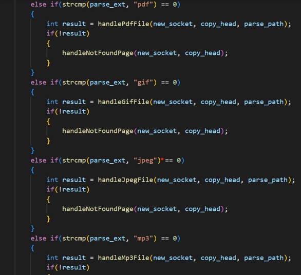
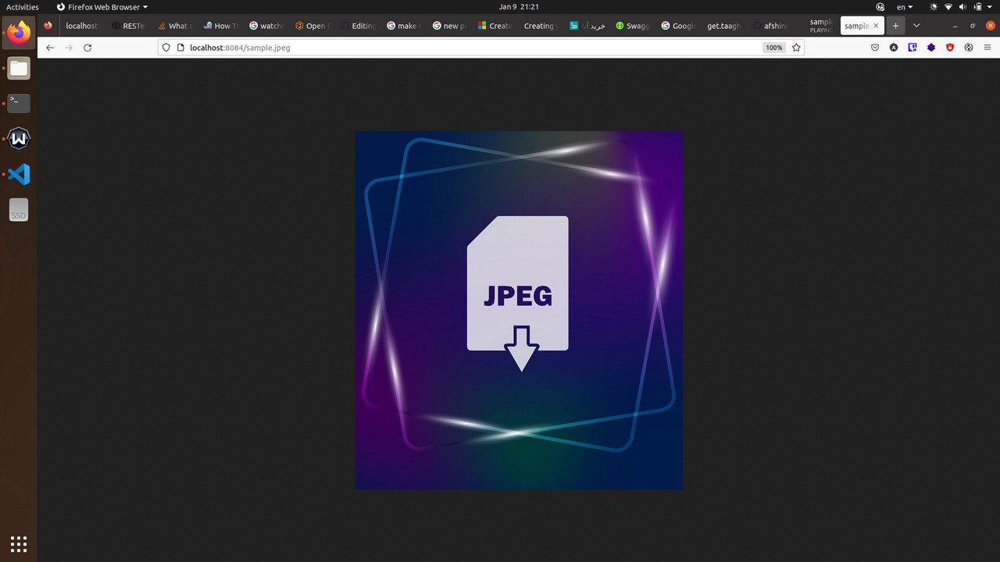

## Mini 1

در این پروژه به پیاده سازی یک سیستم مدیریت فایل ftp پرداخته ایم که از سه بخش تشکیل شده است: برنامه‎ی سرور، برنامه‎ی کلاینت و فایل کانفیگ که در ادامه توضیحات هر کدام گردآوری شده است. 
برای ارتباط بین دو برنامه سرور و کلاینت از 2 سوکت استفاده می شود که یکی مخصوص دیتا و یکی مخصوص دستورات است و سرور روی دو پورت مجزا که شماره‎ی آن در فایل config ذکر شده است درخواست کلاینت را می پذیرد.

توضیحات برنامه‎ی کلاینت:

این برنامه وظیفه‎ی دریافت دستورات کلاینت و انتقال آنها به سرور را دارد و این دستورات در قالب کلاس Command تعریف می شوند:

 

پارامتر اول کلید واژه‎ی دستوری است که کاربر وارد می کند به عنوان مثال “mkd” .
پارامتر دوم کلیدواژه‎ی نظیر این دستور در سیستم عامل است مثلا برای “mkd” در سیستم عانل “mkdir” وجود دارد. 
پارامتر سوم تعداد آرگومان هایی است که این دستور می پذیرد. این مقدار در دستورات این پروژه بین 0 تا 2 آرگومان متغیر می‎باشد.
پارامتر چهارم تعیین می کند که آیا این دستور علاوه بر کانال دستورات از کانال داده ها هم استفاده می کند یا خیر.

مجموعه دستورات این پروژه در CommandRepository نگه داری می شود:

 

در ادامه توابع connect_to_server ، custom_send و custom_read قرار دارند که مورد اول با استفاده از تابع socket و inet_pton شماره ی فایل دیسکریپتور و آدرس سرور را دریافت و با استفاده از تابع connect به سرور متصل می شود و دو تابع دیگر نیز همان توابع send و read کتابخانه‎ی سوکت هستند با ورودی و خروجی منظم تر و تمیزتر که در برنامه به جای استفاده مستقیم از read و send از آنها استفاده می کنیم

در ادامه تابع main قرار دارد در ابتدای آن فایل کانفیگ خوانده شده و مقدار پورت ها از روی آن خوانده شده و ذخیره می شود و پس از آن دو کانکشن مربوط به دستور و دیتا با سرور برقرار می شود و سپس در حلقه while دستور از کاربر گرفته می شود که این دستور هرچیزی غیر از “quit” باشد در این حلقه پردازش می شود.

 

اگر دستور به صورت درست تایپ شده باشد در ادامه آرگومان های آن نیز دریافت می شود 

 

سپس معادل سیستمی دستور به سرور ارسال می شود و پاسخ آن دریافت شده و نمایش داده می شود. همچنین اگر پاسخ سرور دارای body باشد از طریق کانکشن مربوط به دیتا 
دریافت شده و نمایش داده می شود  

و اگر دستور وارد شده در سیستم موجود نباشد پیغام مناسب نمایش داده خواهد شد

 

توضیحات فایل سرور:

در ابتدای برنامه متغیرها و موارد ثابت موردنیاز تعریف شده است
پس از آن کلاس User و UserRepository تعریف شده است که مسئولیت نگه داری کاربران را دارد و برای هرکاربر نام کاربری و رمز عبور و مقدار حجم باقیمانده و اینکه کاربر عادی است یا مدیر نگه‎داری می شود.

 

همچنین کلاس های File و FileRepository برای تعریف و نگه داری فابل ها استفاده می شود. برای هر فایل مسیر آن و سطح دسترسی فایل نگه داری می شود

برای نگه داری دستورات کلاس های Command و CommandRepository در نظر گرفته شده که تقریبا مشابه آن در برنامه کلاینت وجود دارد با این تفاوت که در اینجا علاوه بر اطلاعات قبلی برای هر دستور خروجی مناسب آن نیز نگه داری می شود. 
 
 

در ادامه کلاس CustomSocket قرار دارد که اظلاعات سوکت برقرار شده را نگه داری می کند و کانستراکتور ان همان وظیفه برقراری کانکشن و گوش دادن روی پورت داده شده را دارد و همچنین بوسیله bind امکان برقراری چندین کلاینت همزمان را ممکن می سازد 
پس از آن توابع setup_logfile و logg برای نگه داری لاگ های سرور درون فایل استفاده می شود گه مورد اول برای مقدار دهی اولیه استفاده می شود و تابع logg هر جا که نیاز به ثبت لاگ باشد صدا زده می شود
 
 

توابع custom_send و custom_read مشابه همتای خود در برنامه کلاینت هستند و علاوه بر آن لاگ هم ثبت می کنند.

تابع مورد استفاده بعدی تابع login می باشد که با دریافت شماره ی فایل دیسکریپتور کلاینت مورد نظر با او ارتباط برقرار می کند و پس از دریافت نام کاربری اگر در سیستم چنین کاربری ثبت شده بود منتظر دستور بعد می ماند و در غیر این صورت پیغام خطای مناسب را به کلاینت ارسال می کند تا نمایش داده شود

برای اینکه دستورات در سیستم عانل به صورت واقغی اجرا شود نیاز داریم تا از systemCall مربوطه استفاده کنیم که این کار توسط تابع run_in_shell انجام می شود و پاسخ مورد نظر نیز دریافت و بازگردانده خواهد شد

در ادامه تابع handle_client را داریم که به گونه ای فعالیت اصلی در پاسخ به درخواست ها را انجام می دهد و برای هر کلاینت بصورت اختصاصی اجرا می شود این تابع در ابتدا با استفاده از login که توضیحات آن داده شد کاربر را لاگین می کند و سپس دستور را از کاربر دریافت می کند. لازم به ذکر است دستوراتی که در این تابع استفاده می شود همگی تبدیل به دستورات سیستم عامل شده اند.
اگر دستور quit باشد دو سوکت ایجاد شده برای این کلاینت بسته می شود و از تابع خارج می شویم
 
 

اگر دستور help باشد پیغام مناسب آن در success_message این دستور قرار دارد که همان را از طریق سوکت command برای کاربر می فرستیم

اگر کاربر دستور retr را وارد کرده باشد ابتدا در fileRepository به دنبال فایل مورد نظر می گردیم سپس اگر توسط کاربر قابل دسترسی بود و حجم کاربر به اندازه فایل یا بیشتر از آن بود پیغام مناسب از طریق سوکت دستورات و همچنین فایل از طریق سوکت دیتا برای کاربر ارسال می شود
 

برای باقی دستورات نیز پاسخ مناسب برای کاربر ارسال می شود 
 
 

در بدنه اصلی سرور که همان تابع main می باشد ابتدا مقدار دهی های اولیه صورت می گیرد که شامل ساهت فایل log سرور، مقدار دهی دستورات، مقدار دهی مسیرها، دریافت اطلاعات لازم از فایل config سرور و برقرار ی سوکت های دیتا و دستورات می باشد.
پس از آن در یک حلقه while بی نهایت سرور آماده پذیرفتن کلاینت ها می باشد و برای هرکدام از آنها یک thread ایجاد می کند که تابع handle_client در آن thread به درخواست های کاربر رسیدگی می کند

––

## Mini 2

در ابتدا یک سوکت باز میکنیم سپس پورتی را از ترمینال خوانده و سوکت را به آن پورت بایند میکنیم

سپس در یک حلقه به درخواست های اسالی به سوت مورد نظر که به پورت مشخص گوش میدهد  رسیدگی میکنیم

درخواست وارد شده میخوانیم و سپس آن را پارس میکنیم و در نهایت با توجه به نوع درخواست به آن رسیدگی میکنیم.

در این حالات جواب های متفاوتی میدهیم که اگر نتیجه ای یافت نشد، به 404 منتقل میشویم

در این توابع نوع محتوا را تعیین میکنیم و سپس با استفاده از تابع sendMessasge فایل مورد نظر را باز میگردانیم

  

در این تایع یک فایل را باز میکنیم و تکه تکه فایل خوانده شده را برای کلاینت مورد نشر ارسال میکنیم. در نهایت اگر فایل پیدا نشود ، 404 برگردانده میشود 

### home :

### render pdf:

### render gif:

### render mp3:

### render jpeg:

### 404 not found:

### my function :

### examples :

## Mini 3

### code : 

#### main:

#### server:

#### client:

#### client main:

#### makefile:

### result :

#### compiling :

#### connecting to server :

#### list :

#### send :

